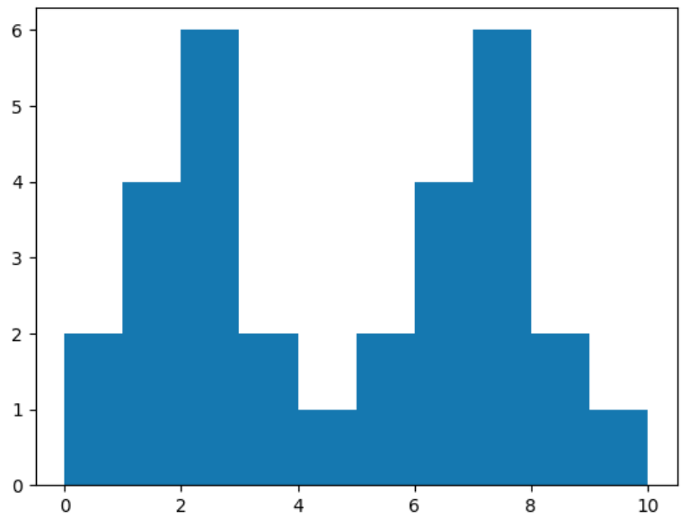

## Table of contents

- [Overview](#overview)
  - [Screenshot](#screenshot)
  - [Built with](#built-with)
  - [What I learned](#what-i-learned)

## Overview

### Screenshot

## My process

### Built with
- Matplotlib
-  numpy library
- jupyter nootebook

## what-i-learned
- How to create a histogram using matplotlib
- How to use the numpy library to generate random data
- How to use jupyter notebook to create interactive visualizations

  
